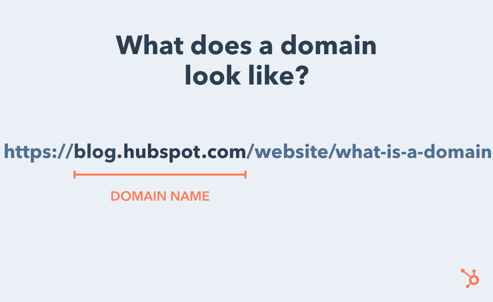
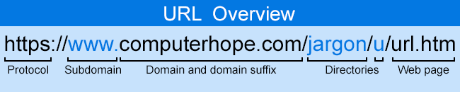
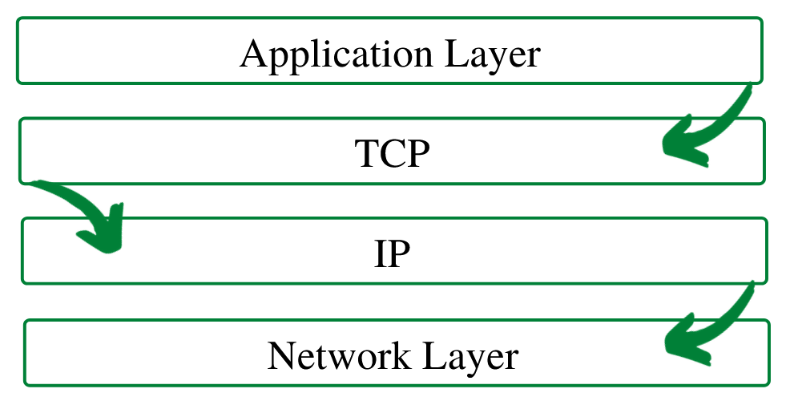
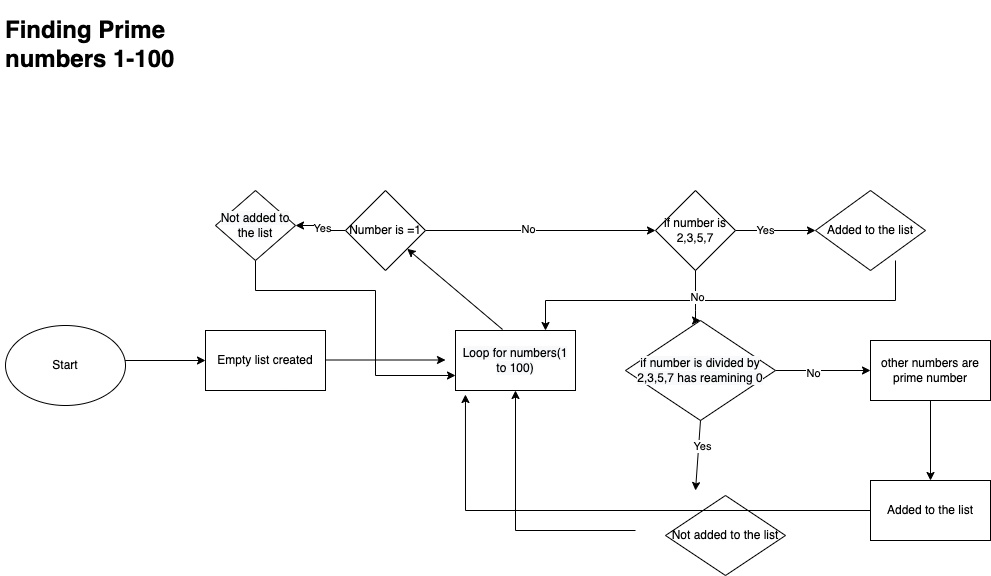

# Question 1

**Identify** and **explain** common and important components and concepts of web development markup languages?

_Answer:_

First of all we need to define what _mark-up_ language is.
A markup language is a human-readable language that is used by computer.

There are different mark-up languages. Some of markup languages are HTML (Hypertext Markup Language) , KML (Key whole Markup Langunage) , MathML(Mathematical Markup Langunage) , SGML(Standard Generalized Markup Language) ,XML(eXtensible Markup Language), XHTML(eXtensible Hypertext Markup Language). Most commomly used in the world is HTML.

There is one thing is common for all mark-up languages which they all use of tags. For instance < >. What inside in brackets is represented by the formatted content. Tags come in pairs,one is opening and the other one is closing.(1) For example

```html
<p></p>
```

But some of tags are self-closign tags.For example

```html

<input />
<br />
<area />
```

Whatever inside between tags can be modified by the formatting. You can modify the text between tags for exampe you can make them bold or italic or you can change font-family,font-size etc...  
There is also element in Markup languages. Element is like tag but extented. An element includes tags as well as what is written between them. For example:

```html
<p>Hello World!</p>
```

Mark-up languages are easy to read. Anyone can understand most of the content.  
Markup languages have set of rules. These rules define to how to use tags. These set of rules allow for consistent and structured document.(2)
Markup languages are not as stirct as programming languages. For example if something wrong in the document, you can not get any complier error like you get programinnig languages.(3)

# Question 2

**Define** the features of the following technologies that are essential in terms of the development of the internet:

- packets
- IP addresses (IPv4 and IPv6)
- routers and routing
- domains and DNS

Explain how each technology has contributed to the development of the internet.

_Answer:_

Defition of the technologies in the question:

- Packets: Data is sent as a package through internet and then these packets are recombined by the computer. For example a user needs to load a file. The file is sent piece by piece from web server. It is called packets of data.And then reseamblied it by the user's computer.(4)

Packets are made of a header and a payload. The header is the data used by networking hardware. The payload is extracted and used by an operation systems, application software or higher layer protocols. Each packet contains a destination address on the network, so routers known where forward them.

**IP address(IPv4 and Ipv6)**

Computers accross the globe to each other in a cirtual space, this invention was called tranmission control protocol(TCP) which was followed bt Internet Protocol(IP). This protocol made it possible for computers on different networks to communicate each other. It is an exclusive address that determines a device on the internet or local network.(5)
There are two types of Ip address which are static IP address and dynamic IP address.(6)

1. Static dynamic address: It never changes. It determines a straightforward and stable way of communication.
2. Dynamic IP address: These are the interim Ip addresses. Each time a computer connected to internet an IP address changes accordingly.There is a pool of IP address and these IP address borrowed from there.

_IP version 4 and IP version 6_ (7)

At the moment there are two types of IP address running which are IP version 4(IPv4) amd IP version 6 (IPv6). There are many aspects with there two types. It was planned to take over the IPv4. It used 128-bit address and supports 2128 i.e. rougly 3.4 X 1038 address.

**IP version 6**

This it the most recent version of IP. It was established by the Internet Engineering Task Force (IETF).

**The feature of IPv6**

1. IPv6 brings improved the ability end-to-end connections than IPv4.
2. It provides faster routing.
3. It contributes more security for applications and networks
4. IPv6 purseus the main design fundamentals of IPv4 and so that the changeover from IPv4 to IPv6 is effortless.
5. The administration is easier than IPv4.
6. Improved flexibility aspects than IPv4.

**IP version 4**

IP Version 4 (IPv4) was described in 1981. It has not changed a lot since that date but in this time, there is a high demand of IP address than IPv4 could supply.

IPv4 runs 32-bit IP address. So the total of IP address is around 4,294,967,296.

An IPv4 address is commonly setup as four 8-bit fields. Each 8-bit field produces a byte of the IPv4 address. There are two parts :the network part and the host part.

The network part represent an unique number for your network. and also describes the class of network.
The host part is a part of IPv4 address is assigned to each host.It describes the computer or device on the network. There are total five classes of IPv4:

1. Class A address : The class A address only consists of IP starting from 1.x.x.x to 126.x.x.x.
2. Class B address : The class B IP Addresses starts from 128.0.x.x to 191.255.x.x. First two digits in the two bits are set to zero.
3. Class C address : Class C address starts 192.0.0 to 223.255.255.x.
4. Class D address : The IP address starts from 224.0.0.0 to 239.255.255.255.
5. Class E class : The Ip address starts from 240.0.0.0 to 255.255.255.254.

**Routers and routing:**
A router is a device. This device can connect, route for network packets according to their address. Routers use packets which contain different kinds of data such as images,files, simple transmissions.

It is designed to receive ,analyse and forward packets between computer networks.(8) A router is like a traffic controller at the airports. You can think data packets as aircrafts headed to different airports in this case networks. Each aircraft has a destination different airports just like each packet data. They needed to be guided by traffic controller, just like data packets are guided by routers.(9)

Routing is the progress of choosing a direction over one or more networks. The basis of routing can implement to any kind of network.(10) It defines directions for IP-packet traffic between networks or within networks.(11) That defines the process of sending a packet data from source to target destination. It uses the Internet Protocols (IP) to travel one destination to the another destination. When router collect a packet data ,it interprets the **headers** of the packet to find out its predetermined destination. There are three types of routing: static routing, default routing and dynamic routing.

1. Static routing: Routes are manually added to the routing table. It does not need to determine bandwith usage between routers.

2. Default routing: All packets is configured and send toward a single router. Stub router is commonly used for this type of routing.
3. Dynamic routing: Modifications are automatically made depends on the present state of the route in the routing table. It practices **protocols** to explore network target destinations and the routes to attain it. (12)

**Domains and DNS**

Domain or domain name is the location of a website. Every website has an IP address.It is good for computers but it is kind of difficult to remember it. That's why we use domain names instead of IP address. A domain name can have up to 63 characters.

(13)

An URL (complete web address) consists of different parts : protocol,domain name (includes subdomain,seceon-level domain,top-level domain),subdirectory,path.

On the example above:

Protocol:https://
domain name:blog.hubspot.com
subdomain:blog
second-level domain:hubspot
top-level domain:.com
subdirectory: /website
path:/what-is-a-domain

(14)

(15)

DNS is the domain name system. It is like the phonebook of the Internet.(16)

DNS converts domain names to IP address so Internet resources can be loaded by browsers. Computers and machines do not understand domain names so it needed to be converted to numerical values.

# Question 3

**Define** the features of the following technologies that are essential in terms of the development of the internet:

- TCP
- HTTP and HTTPS
- web browsers (requests, rendering and developer tools)

Explain how each technology has contributed to the development of client and server communication over the internet (50 - 150 words for each technology)

**Answer**

TCP(Transmission Control Protocol): It is a communication standard. It permits application programs and computers or devices to swap messages over a network.(17) In the digital network, this protocol is one of the most frequently used protocols. TCP construts a data and the data can be sent between a client and a server. It solves many problems such as lost packets,out of order packets, duplicate packets and damaged packets.(18)

It is a stable protocol. It provides flow control.It determines that the data arrives the legitimate destination in the correct order that it was sent.
TCP can reduce the speed of the network because it runs several layers.No changing made since its first development around 30 years ago.(19)

(19)

HTTP and HTTPS:
HTTP is the hypertext Transfer Protocol. it is the foundation of the World Wide Web(www). It is an application layer protocol. It is a request-response protocol for the web.(20)

It was created to implement smooth communicate between devices and applications on the web.(21) There are two sides client and server.Client sends a request to the server. Server reponds the request with a status line or error code.(22)

(22)

HTPPS: This is a secure version of HTTP. It is the primary protocol used to send data between a web browser and a website.

It is encryted to increase the security of data transfer.(23)

It is used a protocol called Transport Layer Security(TLS) but formely known as Secure Sockets Layer(SSL). It is important because it avoids websites from having their information transmit easily access or viewed by anybody sneaking on the network.(23)

**Web browsers:**

A web browser is a software application that allows us to access to the World Wide Web.(24)

Web browsers are used primarily for displaying and accessing websites on the internet.
A web request is a communicating message that is transmitted between the client and the servers. A client enter a URL address and request to connect the website or request to get information. The web browser then connect to the server to get access to the website or get information.

If the website or requested information exists and then the server sends the information to the client or web browser.

Rendering turns a website code into the interactive pages that users see when they go the website.(25)

Devtools are essentials for developer to test their codes, and debug.(26)

## Question 4

**Identify** THREE data structures used in the Python programming language and explain the reasons for using each.

Data structures are important features of any programming languages. Python has different types of data structure such as lists, sets,dictionaries,tuples,strings etc..

I will explain lists,tuples and dictionaries.

**Lists:** A list is a collection of items in a particular order. You can make a list that includes the letters of the alphabet, the digits from 0-9, ot the names of your favorite movies. You can put anything you want into a list. You can store sets of information in one place. It can be few items or million of items. You need to use [] to declare a list.(27)

**Dictionaries:** Dictionaries allow tou to connect pieces of related information together. Limitless amount of information can be stored in dictionaries. Using dictionaries, you can model real-world objects more accurately. They stored information key:value pair. You need to use {} to declare a dictonary.(27)

**Tuples:** Tupples are like lists but you can not change it. In python, if values can not change, its called immutable and immutable lists called tuples. You need to use () instead of [] to declare a tuple.(27)

## Question 5

**Describe** the features of interpreters and compilers and how they are different.

**Interpreters:**When you write a code, you bundle it up and you sent it out the wild for people to run. The people who want to run it have an interpreter on their device for example linux,windows,android machines like java machine.That interpreter creates machine code on the fly. It takes each single instruction of the code, translates it then execute it on its own. The translation step before the program runs is fast because the program will start immediately but execution will run slowly. The great thing about interpretrs is that the program will fully execute until an error occurs. Erros will be displayed after each instruction that contains it.

It converts the whole high-level language program to machine code line by line. Translation is done fast (line by line) but execution is slow. Execute the program without any intermediate code. Errors are displayed for each single instruction.

**Compilers:**
It takes the entire program you wrote in a high-level language and translates the whole of it into machine code at once.After this process an executable file will be ready to run. The translation takes some time to be done but after that execution is so fast. Any error in the program will fully stop it from working ,errors will be displayed at the end of the complitation.
It converts the whole high-level language program to machine code at a time.
Compilation is slow but execution is fast. Generates an intermediate code(executable file). Errors are displayed after the entire program is compiled.

## Question 6

**Identify** TWO commonly used programming languages and explain the benefits and drawbacks of each.

The most common programming languages are Javascript, Python,Java,C#,C,C++,Go,R,Swift and PHP.

I will talk about Javascript and Pyhton.

**Javascript:**
All modern web applications which are applications that used through internet browser are all written using Javascript because it has become the standard in developing web applications. To make user interface smarter and more intelligent we use Javascript to write logic to create features. Examples of features are user registration, booking a ticket, online shopping ,sharing photos, writing messages etc...

It is a dynamic language. It is the only programming language that can actually be understood by a web browser.

Benefits of Javascript:

1. Speed.
2. Clarity. To learn and understand Javascript is easy.
3. It has the ability that works with other programming languages.
4. Javascript supports different interfaces for developing and creating beatiful webpages.
5. Adaptability. You can use Javascript front-end and back-end development language.
6. It uses less code to create beatiful web sides.

Disadvantage of JAvascript:

1. Javascript code can be seen by anybody so other people may use it for vicious intentions.
2. Browsers support Javascript but every browser interprets Javascript differently.
3. Javascript not support multiple inheritance.

4. A single code error can caused to stop the rendering whole Javascript code.(28)

**Python:**
Python is one of the most common programming languages in the world. Python programming language is used by software engineers, mathematicians, data analyts, scientists, accountants, networking engineers.

It is very beginner friendly programinning language.

Advantages:

1. Beginner friendly.Easy to learn.
2. Python is a multi purpose language. You can use it for data analysis, artifical intelligent, automation,web apps, mobile apps,desktop apps,testing, hacking etc...
3. It has extensive libraries.
4. It is portable which means to run Python on different platforms is easy.

Disadvantages:

1. It has poor memory efficiency which means Python requires a lot of memory space to run.
2. If it used a lot of memory, it slows the speed of running the progra,. It is the biggest disadvantage.
3. It is bad for mobile development. It is good for desktop and server platforms.
4. Pyhon is insecure language for database application. Database access has limitations with Python language. Compare to other database programs,Python language is undeveloped and primitive.(29)

## Question 7

## Question 8

Explain control flow, using examples from the Python programming language.

Computers are execude codes in order which is called sequential flow.
But most programs make decision depends on some input or boolean expression which is True or False or comparison methods to make a decision.
It is more efficient way to allow the program we wrote to make decisions depending on the input.

Control flow is the main thing of all artificial intelligence. Contol flow uses comparison operators, functions, if-else statements, loops(for-while,match statements) and/or boolean values.
examle of sequential flow:

```python
num = 10
print("You're" + num +"years old")
mom_age =42

different_age = (mom_age - num)
print("Your mother" + different_age + "older than you")
```

example of control flow:

```python
age = input("Please enter your age: ")
if int(age) < 5 :
    print("Ticket is free")
elif 6 < int(age) <=18:
    print("Ticket price is $15")
elif 19 < int(age) <= 55:
    print("Ticket price is $ 35")
else:
    print("Ticket price is $20")
```

## Question 9

Explain the difference between type coercion and type conversion. Are either of these used in Python?

Type coercion is a automatic conversion of values from one to another. For example string to numbers, numbers to strings. Python language does not support type coercion.

It is always implicit. it can be subdivided into two categories:
first one is programmer conmtrolled and second one is compiler controlled.
Type conversion refers to the general process of changing a type. It can be either explicit or implicit. It is done by manual using built-in functions.

Examples of explicit and implicit type conversions:

Explicit type of conversion:

```python

a = 5

x  =float(a)

print(x)
print(type(x))

b = 5.9

c = int(b)

print(c)
print(type(c))
```

Implicit type of conversion

```python
b = 123
c = 1.23
d =b+c
print(d)

#output would be 124.23


a = 123
b ='456'
v = a+b
print(v)

#it throws a TypeError.
#but Python does not support string and number using + sign to add together. We need to convert string to number before adding so we need to use explicit type conversion.

```

## Question 10

Explain data types, using examples.

Data types in Python are:
String, number ,boolean ,sequence type ,mapping type, set type.

Examples:

1. String

```python
a = "hello"
b= "How are you"
c= "24"
```

2. Number: Number data types in Python are integer, float and complex.

```python

a =2
b=2.4
c = 1 +2j

```

3. Sequence type:

```python

a = ["s","b3",4,5]
b = (23,45,66)

```

4. Mapping type:
   '''python
   a = {
   a:23,
   c:"hello"
   }
   '''
5. Set type:

```python
students ={'david','niki','allison'}
```

6. Boolen type

```python
login = True
answer = False
12> 23 # False
```

## Question 11:

Here’s the problem: “There is a restaurant serving a variety of food. The customers want to be able to buy food of their choice. All the staff just quit, how can you build an app to replace them?”

- Identify the classes you would use to solve the problem
- Write a short explanation of why you would use the classes you have identified

Answer :

If restaurant serves different types of food, it needs to be a main class to genralise food. I would name this class Food,

And then I would create other child classes names Pizza ,Thai , Kebab and Soup. These class names are the food types that we served in the restaurant. Each type of food require different preparation, different ingredients so each child classes need to be created.

```python
class Food:
   def __int__(self):


class Pizza(Food):
    def __init__(self,pizza_type):
        self.pizza_type = pizza_type

class Thai(Food):
    def __init__(self,thaifood):
        self.thaifood = thaifood

class Kebab(Food):
    def __init__(self,kebab_type):
        self.kebab_type = kebab_type
class Soup(Food):
    def __init__(self,soup_type):
        self.soup_type = soup_type
```

## Question 12:

Identify and explain the error in the code snippet below that is preventing correct execution of the program

```python
celcius = input()
fahrenheit = (celcius * 9/5) + 32
print(f"The result is : {fahrenheit}.")
```

The code above is throwing an error because always input return string , so we can not use string in mathematical operations we need to convert string into numeric value. In this example it ise better to use float rather than int, because celcius part might not be integer, so it is better to use float here. We need to write input statements what we are asking. The correct code is below:

```python
celcius = input("Please enter a celcius degree to see Fahrenheit degree : ")
fahrenheit = (float(celcius) *9/5) + 32

print(f"The result is : {fahrenheit}."))

```

## Question 13

The code snippet below looks for the first two elements that are out of order and swaps them; however, it is not producing the correct results. Rewrite the code so that it works correctly.

```python
while (i< len(arr)-1) and (arr[i] < arr[i+1]):
	i += i
	arr[i] = arr[i+1]
	arr[i+1] =arr[i]
```

This code is not working, I used for loop instead of while loop. My code is below:

```python
for items in arr:
	for i in range(len(arr)-1):
		if(arr[i] > arr[i+1]):
			temp = arr[i]
			arr[i] = arr[i+1]
			arr[i+1] = temp
```

## Question 14

Demonstrate your algorithmic thinking through completing the following two tasks, in order:

1.  Create a flowchart to outline the steps for listing all prime numbers between 1 and 100 (inclusive). Your flowchart should make use of standard conventions for flowcharts to indicate processes, tasks, actions, or operations
2.  Write pseudocode for the process outlined in your flowchart

3.  My flowchart is below:



2. Pseudo for the process

a. Start with empty list to fill prime numbers
b. Loop all numbers 1 to 100 (include) using range(1,101)
c. if number is 1 , not added to the list and continue
d. if nummbers 2,3,,5, and 7 added to the list.
e. if number divided by 2,3,5,7 not and remainder is 0 , not added to the list.
f. For other numbers added to the list
g. Display the list

## Question 15

Write pseudocode OR Python code for the following problem:
You have access to two variables: raining (boolean) and temperature (integer). If it’s raining and the temperature is less than 15 degrees, print to the screen “It’s wet and cold”, if it is less than 15 but not raining print “It’s not raining but cold”. If it’s greater than or equal to 15 but not raining print “It’s warm but not raining”, and otherwise tell them “It’s warm and raining”.

I wrote the Python code for the problem:

```python
raining = input("Please enter True for rainy day or False for sunny Day: " )
temperature = input("Please enter temperature Celcius: ")

if raining and float(temperature) < 15:
    print("It's wet and cold")
elif not raining and float(temperature) < 15:
    print("It's not raining but cold")
elif not raining and float(temperature) => 15:
    print("It's varm but not raining")
else:
    print("It's warm and raining")

```

## Question 16:

ACME Corporation are hiring a new junior developer, as part of their hiring criteria they've created a "coding skill score" based on the specific competencies they require for this role; the more important the skill is for ACME corp, the more points it contributes to the "coding skill score" The skills are weighted as follows:

- Python (1)
- Ruby (2)
- Bash (4)
- Git (8)
- HTML (16)
- TDD (32)
- CSS (64)
- JavaScript (128)
  ​
  Write a program that allows a user to input their skills and then tells them
  a) Their overall "coding skill score"
  b) Skills they may want to learn, and how much each one would improve their score

Answer:

My code is below:

```python
skill = "Please enter your coding skill (Python , Ruby,Bash,Git,HTML,TDD,CSS,JavaScript) ,enter 'quit' to exit: "
message = ''
point = 0;
cod_list =[]
valid_list ={"Python" :1, "Ruby":2 , "Bash" : 4 ,"Git" : 8 ,"HTML" : 16 ,"TDD" : 32 ,"CSS" : 64 ,"JavaScript" : 128}


def coding_point (name):
	skill_point = 0
	skill_list =[]
	match name:
			case 'Python':
				skill_list.append("Python")
				skill_point += 1
			case 'Ruby':
				skill_list.append("Ruby")
				skill_point += 2
			case 'Bash':
				skill_list.append("Bash")
				skill_point += 4
			case 'Git':
				skill_list.append("Git")
				skill_point += 8
			case 'HTML':
				skill_list.append("HTML")
				skill_point += 16
			case 'TDD':
				skill_list.append("TDD")
				skill_point += 32
			case 'CSS':
				skill_list.append("CSS")
				skill_point += 64
			case 'JavaScript':
				skill_list.append("JavaScript")
				skill_point += 128
	return skill_point, skill_list

while message != 'quit':

	message = input(skill)

	if message == 'quit':
		break
	elif  message not in valid_list.keys():
		message = input ("This is not valid please enter again :")
		point += coding_point(message)[0]
		cod_list.append(coding_point(message)[1])
	else:
		point += coding_point(message)[0]
		cod_list.append(coding_point(message)[1])

if cod_list[0]:
	for i in range(len(cod_list)):
		if cod_list[i][0] in valid_list.keys():
			valid_list.pop(cod_list[i][0])
else:
	print("Empty list")

print(f"Your overall coding skill score is {point}.")


for key,value in valid_list.items():
	print(f"You could add your coding skill {key} and you could earn {value} point")
```

## References

1. [Semrush](https://www.semrush.com/blog/markup-language/)

2. [Hackr.io](https://hackr.io/blog/what-is-markup-language)
3. [Wpamelia](https://wpamelia.com/markup-languages/)
4. [Cloudflare](https://www.cloudflare.com/en-gb/learning/network-layer/what-is-a-packet/)

5. [wpbeginner](https://www.wpbeginner.com/glossary/ip-address/)

6. [interserver](https://www.interserver.net/tips/kb/types-features-classes-ip-address/)

7. [interserver](https://www.interserver.net/tips/kb/types-features-classes-ip-address/)

8. [Javapoint](https://www.javatpoint.com/router)

9. [Cloudflare](https://www.cloudflare.com/en-gb/learning/network-layer/what-is-a-router/)

10. [Cloudflare](https://www.cloudflare.com/en-gb/learning/network-layer/what-is-routing/)

11. [Cisco](https://www.cisco.com/c/en/us/products/routers/what-is-routing.html)

12. [webopedia](https://www.webopedia.com/definitions/routing/)

13. [blog.hubspot](https://blog.hubspot.com/website/what-is-a-domain)

14. [blog.hubspot](https://blog.hubspot.com/website/what-is-a-domain)

15. [computerhope](https://www.computerhope.com/jargon/d/domain.htm)

16. [Cloudflare](https://www.cloudflare.com/en-gb/learning/dns/what-is-dns/)

17. [fortinet](https://www.fortinet.com/resources/cyberglossary/tcp-ip)

18. [khanacademy](https://www.khanacademy.org/computing/computers-and-internet/xcae6f4a7ff015e7d:the-internet/xcae6f4a7ff015e7d:transporting-packets/a/transmission-control-protocol--tcp)

19. [geeksforgeeks](https://www.geeksforgeeks.org/what-is-transmission-control-protocol-tcp/)

20. [Cloudflare](https://www.cloudflare.com/en-gb/learning/ddos/glossary/hypertext-transfer-protocol-http/)

21. [paessler](https://www.paessler.com/it-explained/http)

22. [tutorialspoint](https://www.tutorialspoint.com/http/http_overview.htm)

23. [cloudflare](https://www.cloudflare.com/en-gb/learning/ssl/what-is-https/)

24. [avast](https://www.avast.com/c-what-is-a-web-browser)

25. [seobility](https://www.seobility.net/en/wiki/Rendering#:~:text=Rendering%20is%20a%20process%20used,to%20render%20a%20web%20page.)

26. [developermozilla](<https://developer.mozilla.org/en-US/docs/Glossary/Developer_Tools#:~:text=Developer%20tools%20(or%20%22development%20tools,allow%20to%20inspect%20a%20website.)>)
27. [geeksforgeeks](https://www.geeksforgeeks.org/python-data-structures/)

28. [data-flair](https://data-flair.training/blogs/advantages-disadvantages-javascript/)
29. [geeksforgeeks](https://www.geeksforgeeks.org/disadvantages-of-python/)
